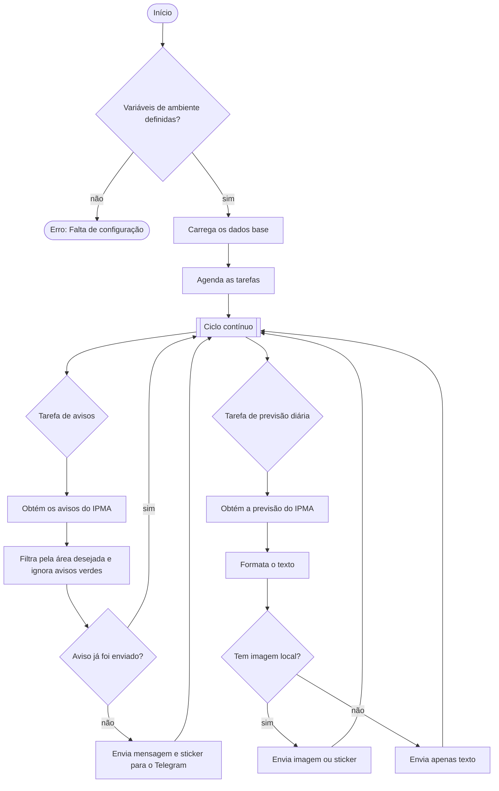

# TG Forecast

Este é um *bot* em Python que envia a previsão do tempo e os avisos meteorológicos do IPMA diretamente para o Telegram, focando-se numa área à tua escolha. Inclui *stickers* e imagens que ilustram o estado do tempo e está preparado para funcionar de forma 100% automática.

## Funcionalidades

- Consulta a previsão diária do IPMA e envia um resumo para o Telegram.
- Monitoriza os avisos meteorológicos e não envia notificações repetidas.
- Escolhe automaticamente um *sticker* (.tgs) ou uma imagem (.png) consoante os ficheiros que tiveres na pasta `images/`.
- Permite a configuração através de variáveis de ambiente, o que facilita a instalação em servidores ou serviços na *cloud*.

## Requisitos

- Python 3.10 ou superior.
- Uma conta de *bot* no Telegram e o respetivo *token* de acesso (`BOT_TOKEN`).
- Ligação à internet para aceder aos dados públicos do IPMA.

## Configuração

1. Cria um ficheiro chamado `.env` na raiz do projeto (não o incluas nos teus *commits* de código) com as seguintes variáveis:

    ```ini
    BOT_TOKEN=o_teu_token_do_telegram
    CHAT_ID=o_id_do_chat_de_destino
    IPMA_WARNINGS_URL=[https://api.ipma.pt/open-data/forecast/warnings/warnings_www.json](https://api.ipma.pt/open-data/forecast/warnings/warnings_www.json)
    IPMA_FORECAST_BASE=[https://api.ipma.pt/open-data/forecast/meteorology/cities/daily/](https://api.ipma.pt/open-data/forecast/meteorology/cities/daily/)
    IPMA_GLOBAL_ID=1010500              # O identificador global (globalIdLocal) do IPMA
    TARGET_AREA_ID=AVEIRO               # A zona de aviso (idAreaAviso) do IPMA
    DISTRICTS_URL=[https://api.ipma.pt/open-data/forecast/warnings/warnings_districts.json](https://api.ipma.pt/open-data/forecast/warnings/warnings_districts.json)
    WEATHER_TYPES_URL=[https://api.ipma.pt/open-data/weather-type-classe.json](https://api.ipma.pt/open-data/weather-type-classe.json)
    WIND_TYPES_URL=[https://api.ipma.pt/open-data/wind-speed-daily-class.json](https://api.ipma.pt/open-data/wind-speed-daily-class.json)
    CHECK_INTERVAL_MINUTES=60           # Minutos de espera entre cada verificação de avisos
    FORECAST_TIME=20:30                 # Hora a que queres receber a previsão diária
    WARNINGS_CACHE_FILE=sent_warnings_cache.json  # Ficheiro onde o bot guarda os avisos já enviados
    WARNINGS_CACHE_RETENTION_HOURS=168  # Tempo (em horas) para guardar registos antigos
    WARNING_EXPIRY_GRACE_HOURS=6        # Margem (em horas) após o fim do aviso antes de o apagar do histórico
    ```

**Como funciona a limpeza do histórico (cache) de avisos:**

- O *bot* guarda os avisos que já enviou no ficheiro `WARNINGS_CACHE_FILE` com a respetiva data de validade.
- Quando a validade passa, os avisos são apagados automaticamente sempre que o *bot* arranca ou faz uma nova verificação.
- Se usavas a versão anterior do *bot*, o formato antigo de dados é atualizado de forma automática.

1. Confirma se tens a pasta `images/` no projeto, pois é lá que o *bot* vai procurar as imagens e *stickers*.

## Execução Local

Para correres o *bot* no teu computador ou servidor de forma isolada:

```bash
python -m venv .venv

# Em Windows:
.venv\Scripts\activate
# Em Linux/macOS:
source .venv/bin/activate

pip install -r requirements.txt
python forecast.py
```

O *script* corre continuamente. Precisas de garantir que o processo se mantém ativo (podes usar ferramentas como o `nohup`, criar um serviço `systemd`, ou usar o `tmux`/`screen`).

## Docker

Se preferires usar o Docker, a construção e execução são simples:

```bash
docker build -t tg-forecast .
docker run --env-file .env tg-forecast

```

Se usares o Docker Compose:

```bash
docker compose up --build

```

## Estrutura do Projeto

- `forecast.py`: É onde está a lógica principal (obtém os dados do IPMA, formata a mensagem e envia para o Telegram).
- `images/`: Pasta para os *stickers* e imagens que correspondem ao tipo de tempo e aos avisos do IPMA.
- `requirements.txt`: Lista das bibliotecas de Python necessárias para o *bot* funcionar.

## Fluxo de Funcionamento



## Contribuir

1. Cria um novo *branch* a partir do `main`.
2. Adiciona as tuas alterações e certifica-te de que tudo funciona.
3. Abre um *Pull Request* (PR) com uma breve descrição do problema que resolveste e os testes que fizeste.

## Suporte

Se encontrares algum problema, abre um *issue* no GitHub com os detalhes e os passos necessários para reproduzir o erro.
